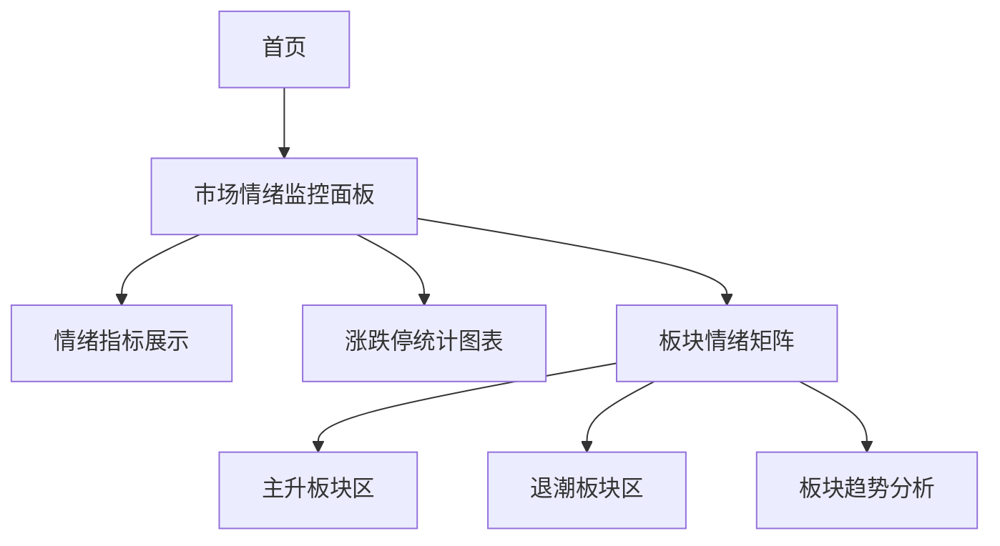

## 1. 产品概述
市场情绪监控系统是一个实时展示A股市场整体情绪状态和板块情绪变化的金融数据可视化平台。通过量化指标和可视化图表，帮助投资者快速了解市场热度和风险状况，辅助投资决策。

目标用户为股票投资者、交易员和金融分析师，提供直观的市场情绪参考指标。

## 2. 核心功能

### 2.1 用户角色
| 角色 | 注册方式 | 核心权限 |
|------|----------|----------|
| 访客用户 | 无需注册 | 查看基础市场情绪数据 |
| 注册用户 | 邮箱注册 | 查看完整数据、设置提醒、收藏板块 |

### 2.2 功能模块
系统包含以下核心页面：
1. **市场情绪监控面板**：实时情绪指标、涨跌停统计、趋势图表
2. **板块情绪矩阵**：主升板块识别、退潮板块警示、板块趋势分析

### 2.3 页面详情
| 页面名称 | 模块名称 | 功能描述 |
|----------|----------|----------|
| 市场情绪监控面板 | 实时情绪趋势 | 显示当前市场情绪状态（递增/递减/震荡），包含趋势方向箭头指示 |
| 市场情绪监控面板 | 涨跌停统计 | 展示涨停家数和跌停家数的实时变化曲线图 |
| 市场情绪监控面板 | 情绪强度指标 | 量化显示市场情绪强度（0-100分），支持历史数据对比 |
| 板块情绪矩阵 | 主升板块识别 | 自动识别涨停个股≥3的板块，高亮显示并金色脉冲边框动画 |
| 板块情绪矩阵 | 退潮板块识别 | 自动识别跌停个股≥3的板块，红色闪烁警示标记 |
| 板块情绪矩阵 | 板块趋势变化 | 展示各板块情绪趋势变化（递增/递减）和平滑过渡动画 |

## 3. 核心流程
用户访问流程：
1. 用户进入首页，首先看到市场情绪监控面板
2. 面板展示实时情绪指标和涨跌停数据
3. 用户可切换到板块情绪矩阵查看详细板块分析
4. 系统自动识别并标记主升/退潮板块

## 4. 用户界面设计

### 4.1 设计规范
**主题色调**：
- 主背景：深蓝(#0f172a)
- 强调色：金色(#fbbf24)
- 递增趋势：绿色渐变(#10b981 → #047857)
- 递减趋势：红色渐变(#ef4444 → #b91c1c)
- 震荡状态：灰色(#64748b)

**动效设计**：
- 主升板块：金色脉冲边框动画（2秒循环）
- 退潮板块：红色闪烁警示（1秒间隔）
- 趋势变化：平滑过渡动画（0.3秒缓动）

**布局风格**：
- 数据卡片：磨砂玻璃效果 + 柔和阴影
- 响应式网格布局
- 卡片式信息展示

### 4.2 页面设计
| 页面名称 | 模块名称 | UI元素 |
|----------|----------|--------|
| 市场情绪监控面板 | 情绪指标区 | 大号数字显示情绪分数，趋势箭头，渐变背景色反映状态 |
| 市场情绪监控面板 | 涨跌停图表 | 双曲线图展示涨停/跌停家数变化，支持时间轴切换 |
| 板块情绪矩阵 | 板块卡片网格 | 卡片式布局，每块显示板块名称、涨停数、趋势指示 |

### 4.3 响应式设计
- 桌面端优先设计
- 平板端：2列网格布局
- 手机端：单列布局，关键指标优先显示
- 支持触摸滑动切换板块视图