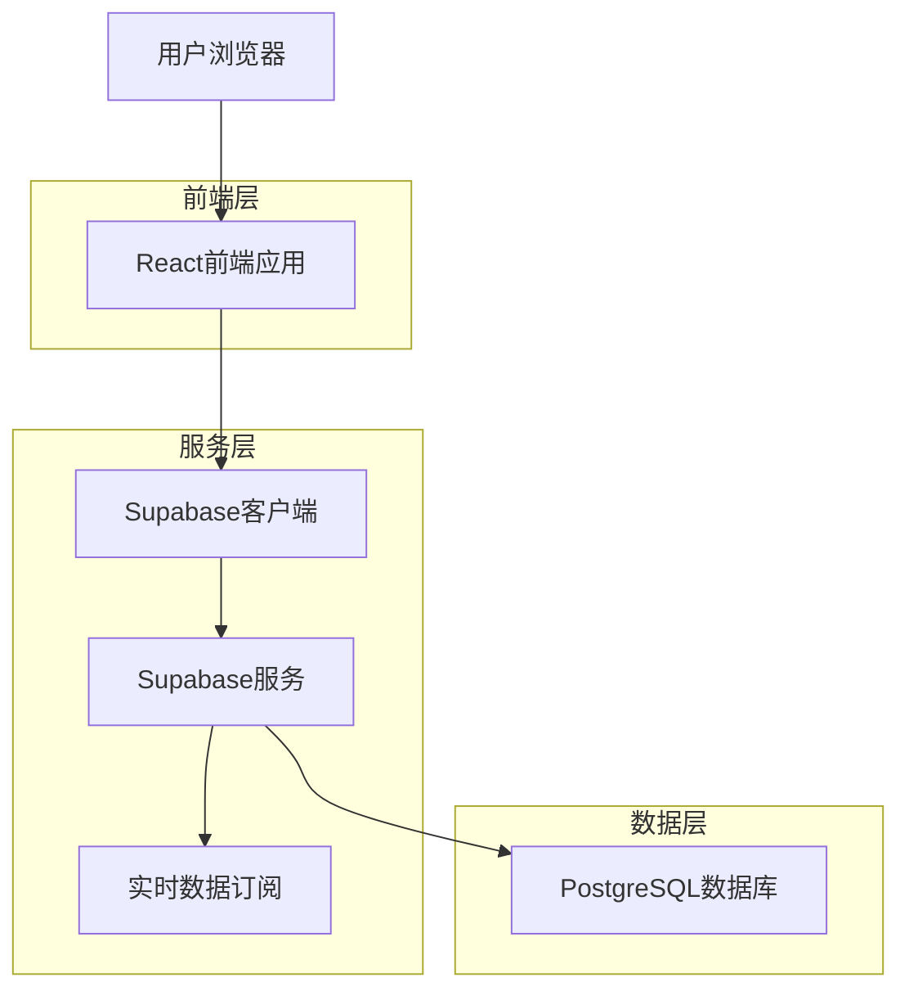
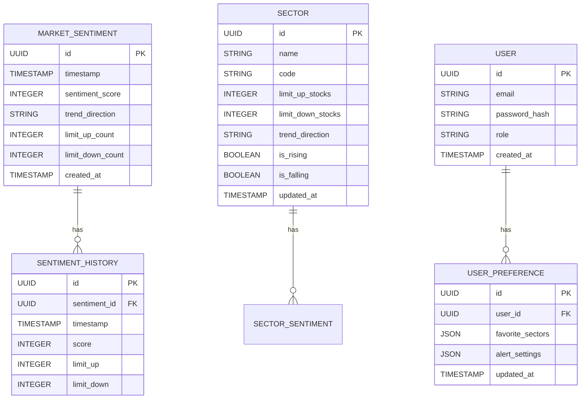

## 1. 架构设计



## 2. 技术栈
- 前端：React@18 + TailwindCSS@3 + Vite
- 初始化工具：vite-init
- 后端：Supabase（BaaS）
- 数据库：PostgreSQL（Supabase提供）
- 实时通信：Supabase实时订阅
- 图表库：Chart.js或Recharts
- 状态管理：React Context + useReducer

## 3. 路由定义
| 路由 | 用途 |
|------|------|
| / | 首页，市场情绪监控面板 |
| /sectors | 板块情绪矩阵页面 |
| /login | 用户登录页面 |
| /register | 用户注册页面 |

## 4. 数据模型

### 4.1 实体关系图


### 4.2 数据定义语言

市场情绪表（market_sentiment）
```sql
-- 创建表
CREATE TABLE market_sentiment (
    id UUID PRIMARY KEY DEFAULT gen_random_uuid(),
    timestamp TIMESTAMP WITH TIME ZONE DEFAULT NOW(),
    sentiment_score INTEGER CHECK (sentiment_score >= 0 AND sentiment_score <= 100),
    trend_direction VARCHAR(10) CHECK (trend_direction IN ('up', 'down', 'sideways')),
    limit_up_count INTEGER DEFAULT 0,
    limit_down_count INTEGER DEFAULT 0,
    created_at TIMESTAMP WITH TIME ZONE DEFAULT NOW()
);

-- 创建索引
CREATE INDEX idx_market_sentiment_timestamp ON market_sentiment(timestamp DESC);
CREATE INDEX idx_market_sentiment_trend ON market_sentiment(trend_direction);
```

板块数据表（sectors）
```sql
-- 创建表
CREATE TABLE sectors (
    id UUID PRIMARY KEY DEFAULT gen_random_uuid(),
    name VARCHAR(100) NOT NULL,
    code VARCHAR(20) UNIQUE NOT NULL,
    limit_up_stocks INTEGER DEFAULT 0,
    limit_down_stocks INTEGER DEFAULT 0,
    trend_direction VARCHAR(10) CHECK (trend_direction IN ('up', 'down', 'sideways')),
    is_rising BOOLEAN DEFAULT FALSE,
    is_falling BOOLEAN DEFAULT FALSE,
    updated_at TIMESTAMP WITH TIME ZONE DEFAULT NOW()
);

-- 创建索引
CREATE INDEX idx_sectors_trend ON sectors(trend_direction);
CREATE INDEX idx_sectors_rising ON sectors(is_rising);
CREATE INDEX idx_sectors_falling ON sectors(is_falling);
```

### 4.3 权限设置
```sql
-- 匿名用户权限
GRANT SELECT ON market_sentiment TO anon;
GRANT SELECT ON sectors TO anon;
GRANT SELECT ON sentiment_history TO anon;

-- 认证用户权限
GRANT ALL PRIVILEGES ON market_sentiment TO authenticated;
GRANT ALL PRIVILEGES ON sectors TO authenticated;
GRANT ALL PRIVILEGES ON sentiment_history TO authenticated;
GRANT ALL PRIVILEGES ON user_preference TO authenticated;
```

## 5. 实时数据更新策略

### 5.1 数据获取流程
1. **定时任务**：每30秒从股票API获取最新数据
2. **数据处理**：计算情绪分数、识别涨跌停股票
3. **数据存储**：更新数据库记录
4. **实时推送**：通过Supabase实时订阅推送给前端

### 5.2 情绪计算算法
- **情绪分数** = (涨停家数 - 跌停家数) / 总交易股票数 * 100 + 50
- **趋势判断**：
  - 递增：连续3个时间点分数上升
  - 递减：连续3个时间点分数下降
  - 震荡：其他情况

### 5.3 板块识别规则
- **主升板块**：涨停个股数 ≥ 3且趋势向上
- **退潮板块**：跌停个股数 ≥ 3且趋势向下

## 6. 前端组件架构

### 6.1 核心组件
- `SentimentPanel`：市场情绪主面板
- `SectorMatrix`：板块情绪矩阵
- `TrendChart`：趋势图表组件
- `SentimentCard`：情绪指标卡片
- `SectorCard`：板块信息卡片

### 6.2 状态管理
- 使用React Context管理全局状态
- 实现自定义hooks处理数据订阅
- 本地缓存机制减少API调用

### 6.3 性能优化
- 虚拟滚动处理大量板块数据
- 防抖处理实时更新
- 图表数据采样减少渲染负担